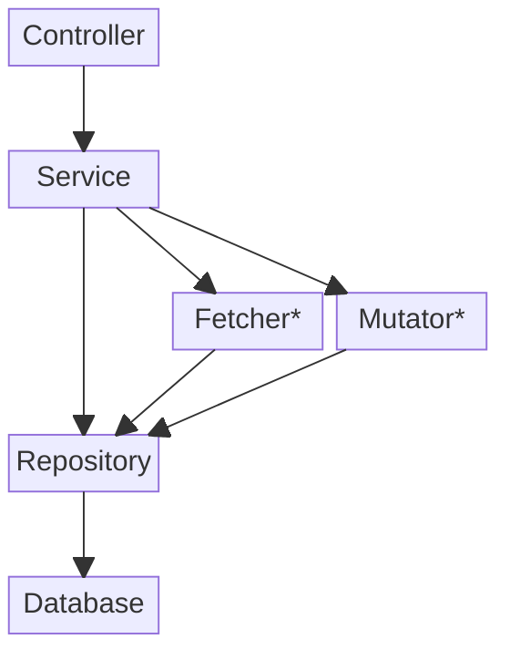

# Personal Website

This is a mono repo project for my personal website.

---

## Contents

1. Services
2. Building
3. Deploying

---

## Services

My website comprises a couple of services.

- A spring boot server as an api
- A Next.js React app as the frontend website
- A Postgres database for storing dynamic content

## Building

I have set up a mono repo to build the two sections using Gradle.
This allows build scripts to be all written in kotlin.

In this section, I'll be listing commands to build and configure each project.

### Spring Server

To run the server locally:

- gradle command:
  `./gradlew :backend:bootRun --args='--spring.profiles.active=dev'`
- environment variables
    - GITHUB_ACCESS_TOKEN: Your personal GitHub token
    - USERNAME: Admin account username
    - PASSWORD: Admin account password
    - POSTGRES_USER: Postgres username
    - POSTGRES_PASSWORD: Password to be set on the postgres container;
    - POSTGRES_URL: The url to the postgress db (not sure if this is used?)

To build the server: `./gradlew :backend:build`

#### Architecture

*Rough latering of components*
